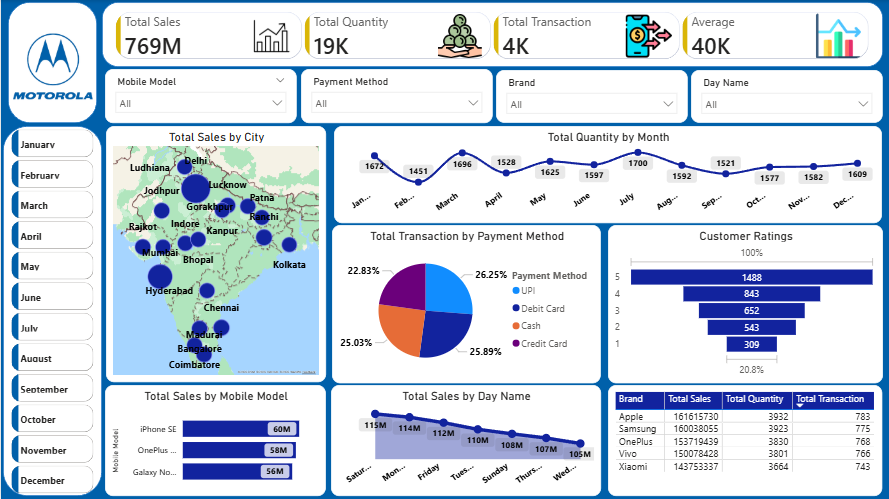

# Mobile Sales Power BI Dashboard
## 📌 Project Overview

This Power BI dashboard analyzes mobile phone sales performance across cities, brands, models, months, payment methods, and customer ratings. It provides dynamic insights into revenue trends, purchasing behavior, and brand performance using interactive visualizations.

## 🛠 Tools Used

Power BI

DAX

Data Modeling

Power Query

Data Cleaning & Transformation

## 📊 Dashboard Features

Total Sales, Quantity, Transactions & Average Value KPIs

City-wise sales visualization on India map

Month-wise sales quantity trend

Brand-wise sales comparison

Payment method distribution analysis

Customer ratings performance

Model-wise and day-wise sales breakdown

Interactive slicers for Month, Brand, Model, Payment Method & Day

## 🔍 Key Insights

Delhi, Mumbai & Bangalore generate the highest mobile sales

UPI is the most preferred payment method

Apple and Samsung lead overall revenue

Weekends show higher transaction volume

iPhone SE and OnePlus models are top-selling products

## 🎯 Outcome

This dashboard helps in understanding sales trends, optimizing inventory planning, improving payment strategies, and identifying top-performing brands and cities for business expansion.

